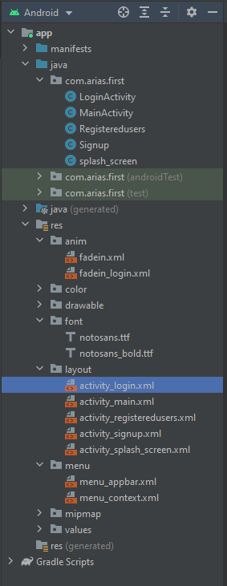
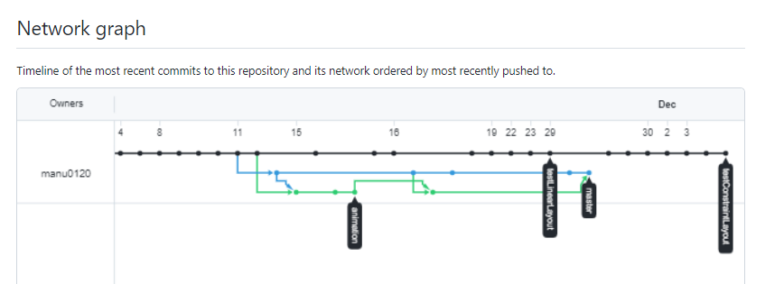
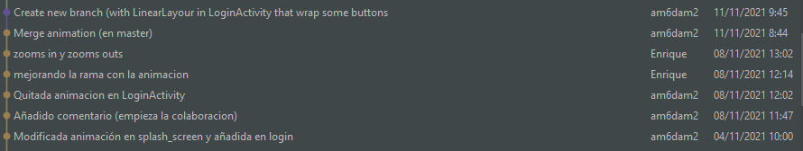

# TIME CONTROLLER

Se trata de una aplicación en la que los usuarios podrán gestionar de manera más
eficiente su tiempo y dividir sus tareas a través de multiples tareas. Asimismo
los usuarios podrán disfrutar de mayor cantidad de tiempo libre.

### Estructura de la aplicacion

### Network graph

En este gráfico se puede ver las ramas de desarrollo que se han ido creando durante el proyecto.

### Icono de la aplicación

### Animación de splash_screen y activity_login
Se ha implementado una animación en el logo:

### Login
Tras unos segundos de animación en splash_screen, el siguiente activity que se inicia es el Login Activity.
El aspecto que tiene es el siguiente:

### Signup
Esta activity tiene el siguiente aspecto:

### Main

En esta ventana se ha implementado un SwipeRefresh, el cual genera cada vez que se hace
swipe genera caras de persoonas que no existen.

El menú de la barra de arriba (appbar) ha sido diseñado en menu_appbar.xml. Este xml se ha referenciado  
en MainActivity.java a traves del método "onCreateOptionsMenu"

[Código Java](https://github.com/manu0120/First_v3/blob/testConstraintLayout/app/src/main/java/com/arias/first/MainActivity.java)

[Código XML Menu appbar](https://github.com/manu0120/First_v3/blob/testConstraintLayout/app/src/main/res/menu/menu_appbar.xml)

Las funcionalidades de este menú se pueden ver en este video:

### Registered Users
Esta ventana tiene como base un ConstraintLayout, que a su vez contiene varios CardView en
los que se han añadido un ImageView y TextView

### Colaboracion

En la siguiente foto se puede ver como otro compañero ha colaborado en mi proyecto para
mejorar las animaciones.

